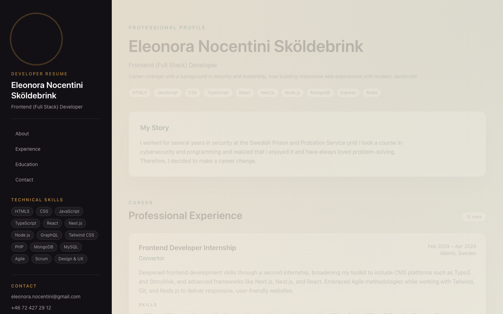
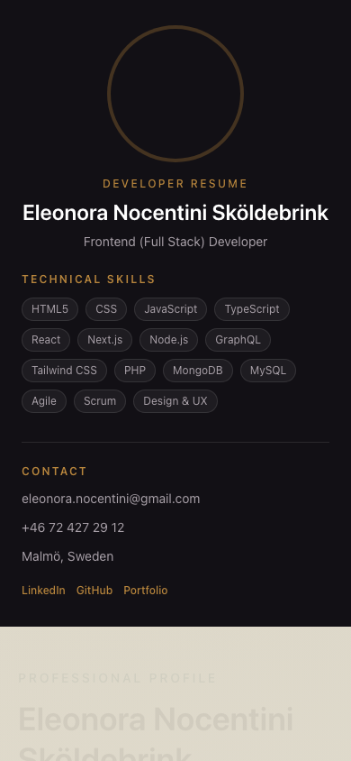
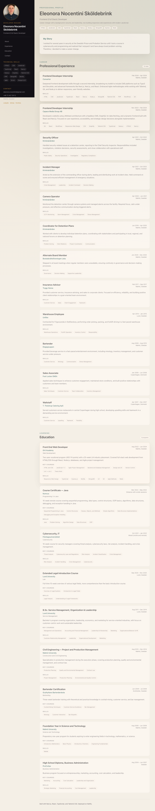

# Developer Resume Site

[](https://app.netlify.com/projects/developer-resume-site/deploys)
[](https://nextjs.org/)
[](https://react.dev/)
[](https://www.typescriptlang.org/)
[](https://tailwindcss.com/)

Professional developer resume for **Eleonora Nocentini Sköldebrink** — a career-changing frontend and full-stack developer with experience in modern JavaScript, React, and Next.js. This site complements my [project portfolio](https://eleonora-portfolio.netlify.app/) with a traditional CV layout covering work history, education, and technical skills.

**Live site:** [developer-resume-site.netlify.app](https://developer-resume-site.netlify.app/)

## Screenshots

### Desktop — profile and sidebar



### Mobile — responsive layout



### Full page overview



## Features

- **Professional CV layout** — sticky sidebar with photo, skills, and contact; scrollable main content for experience and education
- **12 work experiences** — from frontend internships to prior careers in security, leadership, and service
- **9 education entries** — vocational web development training through university degrees
- **Skill pills** — scannable tech stacks per role and program
- **Highlighted entries** — recent developer internships and Grit Academy training stand out visually
- **Responsive design** — optimized for desktop recruiters and mobile review
- **Static export** — fast, hostable on any CDN with no server runtime

## Tech Stack

| Layer | Technology |
| --- | --- |
| Framework | Next.js 16 (App Router, static export) |
| UI | React 19, TypeScript 5 |
| Styling | Tailwind CSS 4, custom design tokens |
| Typography | Fraunces (display) + Inter (body) via `next/font` |
| Hosting | Netlify (continuous deployment from `main`) |

## Getting Started

```bash
# Install dependencies
npm install

# Start the dev server
npm run dev

# Lint
npm run lint

# Production build (static export to ./out)
npm run build
```

The site is exported as fully static HTML (`output: "export"`), so the `out/` directory can be hosted on any static host.

## Deployment

Deployed on [Netlify](https://developer-resume-site.netlify.app/) with continuous deployment from [GitHub](https://github.com/Elli2022/developer-resume-site): every push to `main` triggers a build (`npm run build`) and publishes the `out/` directory.

## Project Structure

```
src/
  app/
    layout.tsx          # Root layout, fonts, and SEO metadata
    page.tsx            # Single-page resume layout
    globals.css         # Design tokens and global styles
  components/
    Sidebar.tsx         # Profile photo, nav, skills, contact
    Header.tsx          # About section and story
    ExperienceSection.tsx
    ExperienceItem.tsx
    EducationSection.tsx
    EducationItem.tsx
    SkillPills.tsx
  data/
    profile.ts          # Personal info and skill list
    experience.ts       # Work history data
    education.ts        # Education data
```

## Related

- [Project Portfolio](https://eleonora-portfolio.netlify.app/) — client-style case studies and demos
- [GitHub](https://github.com/Elli2022)
- [LinkedIn](https://www.linkedin.com/in/eleonora-nocentini/)

## License

Private project. Content © Eleonora Nocentini Sköldebrink.
